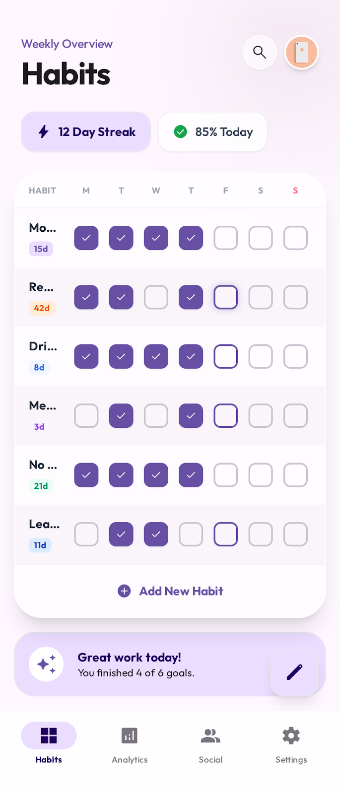

# Home Screen Redesign Plan (Material 3 Expressive)

This plan outlines the visual redesign of the Home Screen (`ListHabitsActivity`) to match the provided design (Material 3 Expressive).

**Goal:** Modernize the visual appearance of the habit list and surrounding elements without introducing new features (like "X days streak" or daily progress).

**Target Files:**
- `uhabits-android/src/main/java/org/isoron/uhabits/activities/habits/list/ListHabitsRootView.kt`
- `uhabits-android/src/main/java/org/isoron/uhabits/activities/habits/list/views/HabitCardView.kt`
- `uhabits-android/src/main/java/org/isoron/uhabits/activities/habits/list/views/HabitCardListView.kt`
- `uhabits-android/src/main/res/layout/` (if we move to XML layouts)

## Step 1: Migration to Material 3 Styling (Root View)

The current root view uses a programmatic `RelativeLayout`. We need to ensure it acts as a proper M3 surface.

1.  **Background Color:** Update `ListHabitsRootView` to use `?attr/colorSurface` or `?attr/colorSurfaceContainer` as the background instead of `?attr/windowBackgroundColor`.
2.  **Toolbar:**
    - Ensure the programmatically created Toolbar (`tbar`) uses `MaterialToolbar` styling.
    - Check title typography (likely `TitleLarge` or `HeadlineSmall`).
    - Remove hardcoded elevation if present, rely on M3 scroll behavior colors.

## Step 2: Redesign Habit Cards (`HabitCardView`)

The habit items are currently `FrameLayout`s with a custom `innerFrame` (LinearLayout) using `R.drawable.ripple` or `R.drawable.selected_box`.

1.  **Container Transformation:**
    - Replace the manual background implementation with a `MaterialCardView` wrapper or simulate it using M3 Shape and StateListDrawables.
    - **Corner Radius:** Increase corner radius to **16dp** (standard for M3 cards).
    - **Elevation:** Remove shadow/elevation for "Filled" or "Outlined" card style, or update to M3 elevation levels if using "Elevated" cards.
    - **Margins/Padding:** Increase spacing between cards to **8dp** or **12dp** vertical, and **16dp** horizontal margin to allow the card to "float" or match the new design's edge-to-edge look.

2.  **Content Layout (`innerFrame`):**
    - **Typography:** Update the habit label (`TextView`) to use `TextAppearance.Material3.BodyLarge`.
    - **Sizing:** Ensure the card height is comfortable (min 56dp or 72dp).
    - **Alignment:** Vertically center the `scoreRing`, `label`, and `checkmarkPanel`.

3.  **Interaction State:**
    - Replace `R.drawable.selected_box` with a proper M3 "Selected" state (e.g., changing container color to `?attr/colorSecondaryContainer` and content to `?attr/colorOnSecondaryContainer`).
    - Ensure the Ripple effect is bounded by the new corner radius.

## Step 3: Checkmark Panel & Score Ring Updates

1.  **Score Ring:**
    - Ensure the ring colors align with the M3 palette (Primary/Secondary).
    - If the design removes the ring, hide it. (Assuming we keep it but restyle it).

2.  **Checkmark Panel (`CheckmarkPanelView`):**
    - The grid of checkmarks/buttons needs to fit visually within the new card.
    - Ensure the touch targets are accessible (48dp).

## Step 4: Header View (Calendar/History)

1.  **Visual Consistency:**
    - Update `HeaderView` to match the background color or be a distinct "Surface" if strictly separated.
    - If the design implies a "floating" list over a background, the header might need to be part of the scrolling content or a collapsing toolbar.

## Step 5: Clean Up & Polish

1.  **Remove Legacy Resources:**
    - Identify and remove `R.drawable.ripple`, `R.drawable.selected_box` if they are no longer used.
2.  **Edge-to-Edge:**
    - Ensure the list clips to padding correctly (already seems to have `clipToPadding=false`) and handles system bars (already handled in `ListHabitsRootView`).

## Execution Order

1.  **Refactor `HabitCardView`**: This is the most visible change. Modify `HabitCardView.kt` to adopt M3 Card styling.
2.  **Update `ListHabitsRootView`**: Adjust background and toolbar.
3.  **Refine Spacing**: Tweak margins in `HabitCardListView` or `HabitCardView` to match the "Expressive" feel.
